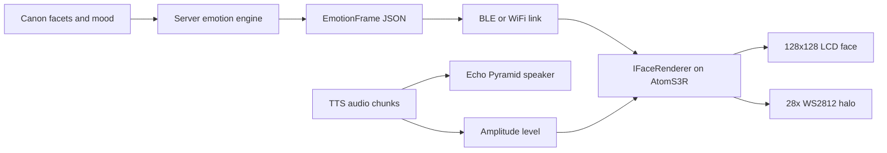

# EMOTION_FACE.md

Emotion-face channel for the Pyramid voice agent (the on-screen face referenced by
MISSION/ARCHITECTURE/ROADMAP).

**Target hardware (v1/v2): AtomS3R + Echo Base** — ESP32-S3, 128×128 LCD, ES8311
codec (single mic + speaker). **No LED halo, no mic array** on this base. The LED
**halo** (§9) and mic array become available later on the **Echo Pyramid base**;
the face logic is identical, the halo simply activates when the hardware has it
(ARCHITECTURE §Hardware variants). PSRAM is board-dependent — verify on the actual
AtomS3R and enable it if present (it relaxes asset/audio RAM limits).

This document defines a single emotion contract emitted by the **server** and a
**ladder of interchangeable renderers** on the device, all behind one
`IFaceRenderer` interface, one `EmotionFrame`, and one emotion enum — so improving
the look is a renderer swap, not a rewrite:

- **Emoji (first — v2.4):** emotion → an emoji / simple glyph. No assets. Proves the channel.
- **Icon sprites (v4.5):** procedural layered sprites + idle loop + crossfade + lip-sync.
- **Lili / artist sprites (later):** the same layer scheme filled with authored art — an asset-only swap.

> **Pyramid adaptation note.** This file originated from a sibling project and is
> reconciled to Pyramid here: the character's identity is the **Role's Name +
> authored Canon** (a character bible — *not* a facet engine or scored portrait;
> see MISSION non-goals), modulated in v3 by **temperament dials** (energy, warmth,
> verbosity, speech-speed, pitch). "Lili" is an *example* art pack/name; the Name
> is configurable per Role. References below to facets / arc-phase / specific
> astrology are illustrative and map onto authored canon traits + mood + temperament.

---

## 1. Goals and non-goals

Goals
- Show the agent's current emotional state on the 128x128 screen, driven by the
  character's **Canon + mood** (and, from v3, **temperament**).
- Decouple emotion logic (server) from visual representation (device).
- Make Phase 1 (stylized icon) and Phase 2 (Lili art) share one contract and one
  asset manifest schema.
- Keep everything local and low-latency: no per-frame cloud calls.

Non-goals
- Photorealistic portrait rendering. At 128x128 the face is a stylized emotion
  icon, not the detailed reference portrait.
- On-device emotion inference. The server decides emotion; the device renders it.

---

## 2. Architecture overview



Two data streams reach the device:
1. EmotionFrame, one per agent turn or per state change (low rate).
2. Audio level, a continuous 0..1 envelope for lip-sync (30-60 Hz), either sent
   from the server or computed on-device from the audio being played.

---

## 3. The emotion contract (shared, both phases)

A single JSON object. Same schema in Phase 1 and Phase 2.

```json
{
  "emotion": "playful",
  "intensity": 0.8,
  "gaze": "center",
  "accent_color": "#E0218A",
  "speaking": true,
  "ttl_ms": 6000
}
```

Fields
- emotion: enum, see section 4. Required.
- intensity: float 0.0..1.0. Scales expressiveness (brow lift, smile depth, halo
  brightness, idle motion amplitude). Required.
- gaze: enum center | up | down | left | right. Optional, default center.
- accent_color: hex string. Optional per-frame override of the halo color; if
  omitted, the renderer uses the color from the emotion recipe.
- speaking: bool. Drives whether lip-sync is active. Optional, default false.
- ttl_ms: int. After this with no new frame, the renderer relaxes to neutral.
  Optional, default 8000.

The audio level is NOT part of this object. It is a separate fast stream:

```
setAudioLevel(level: float 0..1)   // called at 30-60 Hz while speaking
```

---

## 4. Emotion enum

Emotions are derived from the **Canon + the turn's mood** (and, in v3, biased by
temperament). Keep the set small and stable; **every renderer tier (emoji, icon,
lili) implements the same names**. The "canon source" column below is illustrative
— the specific facet/astrology labels come from the sibling project and map onto
Pyramid's authored canon traits + mood; the enum itself is what matters.

| emotion        | canon source (facet / state)        | reads as                         |
|----------------|-------------------------------------|----------------------------------|
| neutral        | base, resting presence              | calm, attentive                  |
| playful        | Trickster (Пустунка)                | bright, teasing half-smile       |
| mischief_wink  | Trickster, high intensity           | one-eye wink, smirk              |
| warm           | base tenderness (Pisces Venus)      | soft warm smile                  |
| tender         | deep tenderness, late arc phase     | very soft, gentle, lidded        |
| thinking       | Mystic (Містик), contemplative      | gaze up or aside, slow blink     |
| focused        | Engineer (Інженерка)                | narrowed eyes, precise, neutral mouth |
| delight        | high positive mood                  | wide eyes, big smile             |
| surprise       | sudden shift                        | wide eyes, raised brows          |
| listening      | attentive, user speaking            | slight head tilt, soft eyes      |
| concern        | user in real distress, wit dropped  | soft, brows up-inner, no smile   |
| affection      | advanced arc phase, high warmth     | soft eyes, warm halo, slow       |

Notes
- concern and affection deliberately suppress Trickster behaviors (no wink, no
  smirk). The face mirrors the canon rule that provocation retreats before real pain.
- Engineer/focused is intentionally the least "dreamy" expression.

---

## 5. Layer model (the key cost-saving decision)

The face is composed from a small bank of layers at render time, not stored as one
full image per emotion. An emotion is a recipe over layers, so N emotions cost a
small bank, not N full faces.

Layers (z-order back to front)
1. background / halo glow (also mapped to WS2812)
2. base face (Phase 1: simple head shape; Phase 2: Lili head art)
3. hair accents (Phase 2 mainly; pink + blue strands)
4. brows: { neutral, raised, furrowed, soft_inner_up }
5. eyes: { open, half, closed, wink_L, wink_R, narrowed, wide, soft_down, up_gaze }
6. mouth: visemes for lip-sync { closed, small, mid, wide } plus expression mouths
   { smile, smirk, soft_line, o }
7. overlay fx (optional sparkle/blush for delight, etc.)

Lip-sync uses ONLY the mouth viseme set and is independent of emotion. Amplitude
maps to a viseme:

```
level < 0.10 -> closed
level < 0.35 -> small
level < 0.65 -> mid
else         -> wide
```

When speaking is false, the mouth uses the expression mouth from the recipe.

---

## 6. Emotion recipe table

Each emotion resolves to a layer recipe. head_tilt is degrees; values scale by
intensity. Colors are placeholders to be finalized from the Lili reference palette.

| emotion       | eyes      | brows         | mouth (idle) | head_tilt | halo_color | halo_pattern |
|---------------|-----------|---------------|--------------|-----------|------------|--------------|
| neutral       | open      | neutral       | soft_line    | 0         | #6A4C93    | steady_dim   |
| playful       | narrowed  | raised        | smirk        | 4         | #E0218A    | pulse        |
| mischief_wink | wink_L    | raised        | smirk        | 6         | #E0218A    | sparkle      |
| warm          | open      | soft          | smile        | 2         | #FF6FB5    | steady       |
| tender        | half      | soft_inner_up | soft_line    | 3         | #FF8FC7    | slow_breathe |
| thinking      | up_gaze   | neutral       | soft_line    | -3        | #2A6FDB    | slow_sweep   |
| focused       | narrowed  | furrowed      | soft_line    | 0         | #2A6FDB    | steady       |
| delight       | wide      | raised        | smile        | 2         | #FF3DAE    | sparkle      |
| surprise      | wide      | raised        | o            | 0         | #00D1D1    | flash        |
| listening     | open      | soft          | soft_line    | 5         | #8A5CFF    | steady_dim   |
| concern       | soft_down | soft_inner_up | soft_line    | -2        | #3A5BA0    | slow_breathe |
| affection     | half      | soft          | smile        | 3         | #FF6FB5    | slow_breathe |

---

## 7. Renderer interface

Firmware codes against one interface. Phase 1 and Phase 2 are two implementations.

```cpp
struct EmotionFrame {
  Emotion  emotion;
  float    intensity;   // 0..1
  Gaze     gaze;        // center/up/down/left/right
  uint32_t accent_color; // 0 = use recipe color
  bool     speaking;
  uint32_t ttl_ms;
};

class IFaceRenderer {
public:
  virtual void begin() = 0;                 // load asset pack into PSRAM
  virtual void show(const EmotionFrame&) = 0; // set target expression (crossfade)
  virtual void setAudioLevel(float lvl) = 0;  // 0..1, called while speaking
  virtual void tick(uint32_t dt_ms) = 0;      // idle loop, blink, breathe, blend
};

class IconRenderer : public IFaceRenderer { /* Phase 1 */ };
class LiliRenderer : public IFaceRenderer { /* Phase 2 */ };
```

Behavior shared by both
- tick() runs the idle loop: periodic blink (every 3-6 s, randomized), a slow
  breathe (subtle vertical bob / halo brightness oscillation), micro gaze drift.
- show() sets a target recipe and crossfades from the current one over ~150-250 ms.
- intensity scales blink rate slightly, smile depth, head_tilt, halo brightness,
  and idle motion amplitude.
- ttl_ms expiry relaxes toward neutral.
- Rendering uses M5GFX / LovyanGFX sprites with DMA push to avoid tearing.

The only difference between phases is which sprite bank the layers draw from.

---

## 8. Asset manifest (shared schema)

Both phases ship an asset pack described by the same manifest, so firmware does not
change between phases. Only the referenced images and the active pack id change.

```json
{
  "pack_id": "icon_v1",
  "canvas": [128, 128],
  "palette": ["#0E0E12", "#E0218A", "#2A6FDB", "#FF6FB5", "#6A4C93"],
  "layers": {
    "base":  { "frames": ["base.png"] },
    "brows": { "neutral": "...", "raised": "...", "furrowed": "...", "soft_inner_up": "..." },
    "eyes":  { "open": "...", "half": "...", "closed": "...", "wink_L": "...",
               "narrowed": "...", "wide": "...", "soft_down": "...", "up_gaze": "..." },
    "mouth": { "closed": "...", "small": "...", "mid": "...", "wide": "...",
               "smile": "...", "smirk": "...", "soft_line": "...", "o": "..." }
  },
  "recipes": { "playful": { "eyes": "narrowed", "brows": "raised", "mouth": "smirk",
                            "head_tilt": 4, "halo": "#E0218A", "pattern": "pulse" } }
}
```

Phase 2 simply provides `pack_id: "lili_v1"` with the same layer keys filled by
Lili art. If a layer key set matches, the renderer swap is transparent.

---

## 9. WS2812 halo (Echo Pyramid, 28 LEDs)

The halo reinforces emotion with color and motion. It is driven from the same
EmotionFrame (halo_color/accent_color + halo_pattern), scaled by intensity.

Patterns: steady, steady_dim, pulse, slow_breathe, slow_sweep, sparkle, flash.
The 28 LEDs are controlled by the base STM32G030; the renderer sends a compact
halo command (color, pattern, brightness) over the base I2C link, or via the
stock base protocol. Halo updates are decoupled from the LCD frame rate.

---

## 10. Lip-sync

Source: the TTS audio being played through the Echo Pyramid speaker.
- Simplest: device computes a short-window RMS envelope of the playback buffer,
  normalizes to 0..1, calls setAudioLevel at 30-60 Hz.
- Better: server sends precomputed level frames aligned to audio chunks (e.g. from
  ElevenLabs alignment timestamps) so mouth and audio stay in sync under latency.
Mouth viseme selection is the amplitude mapping in section 5. Emotion stays driven
by the EmotionFrame; only the mouth layer follows audio while speaking is true.

---

## 11. Asset pipeline by phase

Phase 1 - Icon (no artist)
- Claude Code generates the entire layer bank procedurally (Pillow or SVG rendered
  to PNG): stylized large eyes, brow shapes, viseme mouths, halo, base head.
- Output: 128x128 layer PNGs in the Lili palette + manifest.json (pack_id icon_v1)
  + optional packed atlas for firmware.
- Claude Code also produces a desktop preview that composites recipes so each
  emotion can be reviewed before flashing.

Phase 2 - Lili (external art + Claude Code packing)
- External image generation produces a canonical Lili head and a consistent set of
  expression bases. Consistency is the hard part: use one strong reference plus
  img2img, or train a small LoRA on the Lili look so all expressions are the same
  character.
- The art is cut into the SAME layer scheme (eyes/brows/mouth/hair/base).
- Claude Code handles resize to 128x128, palette quantization, atlas packing, and
  manifest.json (pack_id lili_v1) using the identical schema as Phase 1.

What Claude Code does NOT do: paint the artistic Lili face. It generates geometric
layers, animation frames, sizing, palette, atlas, manifest, and previews.

---

## 12. Mapping to the Pyramid roadmap

- **v1 — no face.** Voice only; the LCD shows text turn-states. (The face needs a
  server to decide emotion; there is none until v2.)
- **v2.4 — emotion channel + emoji face.** The server's emotion engine emits an
  `EmotionFrame` from Canon + mood; the device renders the **emoji** tier. The
  `EmotionFrame` contract + emotion enum + `IFaceRenderer` (and the WS contract
  test) are locked here.
- **v4.1 — emotion halo (Echo Pyramid base).** The WS2812 halo becomes a second
  renderer of the **same `EmotionFrame`** (color/pattern per emotion, speaking
  pulse) — see §9. No new contract; reuses the v2.4 `emotion` message.
- **v4.5 — sprite face (Icon).** Swap `EmojiRenderer` → `IconRenderer`: the layer
  model, idle loop, crossfade, lip-sync, and asset manifest below. The artist
  "Lili" pack is a later asset-only swap over the same scheme.
- **v3.4 — temperament.** Bias the emotion baseline/frequency by the daily
  temperament dials (e.g. higher warmth → more `warm`/`affection`) — presentation
  only, never competence.
- **Halo (v4.1)** activates whenever the hardware has an LED ring (Echo Pyramid
  base); absent on Echo Base.

---

## 13. Repo placement

- `specification/EMOTION_FACE.md` (this file)
- server (v2+): emotion engine emits `EmotionFrame` on the response path (WS `emotion` message)
- firmware: `IFaceRenderer` + `EmojiRenderer` (v2.4), `IconRenderer` (v4.5),
  `LiliRenderer` (later), asset loader; LED-halo driver only on Echo-Pyramid-base hardware
- `assets/face/icon_v1/` and `assets/face/lili_v1/` (manifest + layers/atlas)

---

## 14. Open decisions to confirm before build

- Transport for EmotionFrame: the existing device↔server **WS** link (decided —
  ARCHITECTURE §WS adds an `emotion` message). A BLE side-channel only if a future
  board ever needs it.
- Lip-sync source: device-side RMS vs server-side aligned level frames.
- Final Lili palette hex values, taken from the approved reference.
- Halo control path: direct base I2C vs stock base protocol.
